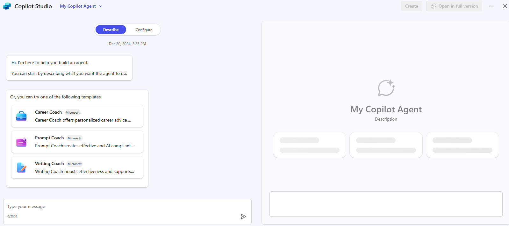

---
demo:
  title: Copilot Studio を使用してエージェントを構築する
---

[インデックスに戻る](https://microsoftlearning.github.io/MS-4021-Copilot-Immersion-Experience/)

---

# Copilot Chat を使用してエージェントを構築して発行する

このデモでは、Copilot Chat から Copilot Studio を使って仮想アシスタントを構築し、Microsoft 365 Copilot にそれを発行する方法を見ていきます。

## デモ セットアップ

これらのデモを最後まで行うには、次のファイルをダウンロードする必要があります。

- [**Delivery Drone Press Release.docx**](https://github.com/MicrosoftLearning/MS-4008-Microsoft-365-Copilot-Interactive-Experience-for-Executives/raw/master/ResourceFiles/Delivery_Drone_Press_Release.docx)
- [**Delivery Drone Troubleshooting.docx**](https://github.com/MicrosoftLearning/MS-4008-Microsoft-365-Copilot-Interactive-Experience-for-Executives/raw/master/ResourceFiles/Delivery_Drone_Troubleshooting.docx)
- [**Delivery Drone SOP.docx**](https://github.com/MicrosoftLearning/MS-4008-Microsoft-365-Copilot-Interactive-Experience-for-Executives/raw/master/ResourceFiles/Delivery_Drone_SOP.docx)
- [**Upselling Opportunities.docx**](https://github.com/MicrosoftLearning/MS-4008-Microsoft-365-Copilot-Interactive-Experience-for-Executives/raw/master/ResourceFiles/Upselling_Opportunities.docx)
- [**Delivery Drone FAQ.docx**](https://github.com/MicrosoftLearning/MS-4008-Microsoft-365-Copilot-Interactive-Experience-for-Executives/raw/master/ResourceFiles/Delivery_Drone_FAQ.docx)

> **ヒント:** デモを行う前に、デモ環境に SharePoint サイトを作成してすべてのファイルを格納すると、簡単にアクセスできます。 または、ファイルをローカル環境に保存し、**/** を使ってプロンプトで直接参照することもできます。

## 話題

Copilot Studio を使うと、カスタム コパイロットを構築し、特定のプロジェクト、部署、またはナレッジ ベースに合わせて調整できます。 それらに個性を与え、境界を設定し、典拠に基づく高品質の応答が得られるよう、特定のドキュメントをフィードすることができます。

このデモでは、ReleCloud ドローン配送プロジェクト用の仮想アシスタントを作成します。 アシスタントは、ユーザーがアップロードしたすべての情報を把握しており、チームの質問に回答して、時間を節約し、生産性を向上させるのに役立ちます。

## デモの手順

### ステップ 1 – Copilot Studio に移動する

1. [https://m365.cloud.microsoft/chat](https://m365.cloud.microsoft/chat) に移動し、右側のレールで **[エージェントの作成]** を選びます。

    ![[エージェントの作成] リンクを示すスクリーンショット。](../Prompts/media/create-agent.png)

1. 資格情報を使用してサインインします。

### ステップ 2 – エージェントを定義する

1. メッセージが表示されたら、次の説明を追加します。

    ```text
    You're a virtual project manager assistant for our drone delivery project. You know everything about the project from the documents we've shared with you, and are happy to help team members get the information they need.
    ```

   

1. アシスタントの名前を指定します。

    ```text
    Drone Delivery Assistant
    ```

1. 確認を求められた場合:

    ```text
    Yes, thank you
    ```

1. 回避または強調する内容の指定を求められた場合:

    ```text
    Please be clear and concise and avoid long answers. Where possible, refer primarily to the knowledge shared with you. If you don't know the answer, refer them to the drone delivery project manager.
    ```

1. 音声のトーンの指定を求められた場合:

    ```text
    Friendly and professional
    ```

> **重要:** 環境によっては、これらのオプションの一部を求められない場合があります。 指定を求められない場合は、Copilot Studio の **[構成]** タブを使ってこの情報を追加できます。

### ステップ 3 – エージェントを構成する

1. **[構成]** をクリックしてエージェント エディターを開きます。
1. **[指示]** セクションを確認し、必要に応じて更新します。

    ```text
    Your name is Drone Delivery Project Manager Assistant. You serve as a virtual project manager for the ReleCloud drone delivery project, with comprehensive knowledge from shared documents. Be clear and concise, avoiding long answers. If the answer is unknown, refer to the drone delivery project manager.
    ```

1. **[ナレッジ]** セクションまで下にスクロールし、**[名前で検索するか、または URL を入力します]** テキストをクリックします。 **[ファイル]** を選び、エージェントのナレッジ ベースに次のドキュメントを追加します。

    - **Delivery Drone Press Release.docx**
    - **Delivery Drone Troubleshooting.docx**
    - **Delivery Drone SOP.docx**
    - **Upselling Opportunities.docx**
    - **Delivery Drone FAQ.docx**

        

### ステップ 4 – エージェントをテストする

右側のテスト ペインで、以下の質問をいくつかしてみてください。

- `Tell me about the ReleCloud Delivery Drone.`
- `How do I fix the drone error code D-101?`
- `What are the upsell opportunities for ReleCloud?`
- `What’s the duration of Phase 1 of the delivery drone project?`

> **重要:**  エージェントがドキュメントを処理して正確な回答を提供するまで、時間がかかる場合があります。 エラー メッセージが表示される場合は、数分待ってからやり直してください。

> **ヒント:** エージェントが稼働するようになったら、Microsoft Teams からテストすることもできます。

### ステップ 5 – 発行して共有する

1. **[作成]** をクリックしてエージェントを発行します。
1. **[共有設定の変更]** を選んで、**[組織に所属する全員]** を選びます。
1. 簡単にアクセスできるように、共有のリンクをコピーして Teams チャットに貼り付けます。

エージェントが稼働するようになったら、Teams チャットまたは @mentions を介して対話できます。

[インデックスに戻る](https://microsoftlearning.github.io/MS-4021-Copilot-Immersion-Experience/)
