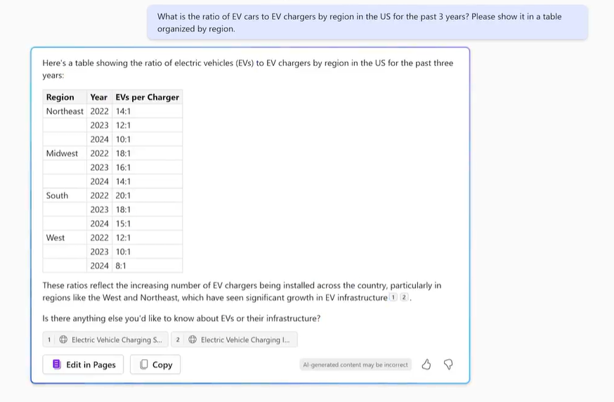

---
demo:
  title: 営業デモ
---

[インデックスに戻る](https://microsoftlearning.github.io/MS-4021-Copilot-Immersion-Experience/)

# 営業デモ

**シナリオ:**

あなたは EV 充電会社の営業をしており、来年の戦略計画を策定しています。 Copilot を使って、より広い EV 市場の動向を調査し、自身の地域販売データと対比し、その結果得られた推奨事項を Word で完全な実装提案に展開し、その提案を PowerPoint ですぐに使用できるデッキに変換します。

## デモ セットアップ

サンプル ドキュメントは、[こちら](https://github.com/MicrosoftLearning/MS-4021-Copilot-Immersion-Experience/tree/master/ResourceFiles)の MS-4021 GitHub リポジトリにあります。

このデモに必要な具体的なファイルは次のとおりです。

- [Charger_sales_report_2022-2024.xlsx](https://github.com/MicrosoftLearning/MS-4021-Copilot-Immersion-Experience/raw/master/ResourceFiles/Charger_sales_report_2022-2024.xlsx)

> **注:** これらのファイルがダウンロード後に OneDrive に同期されるまでに最大 10 分かかることがあります。 デモ中の遅延を避けるために、事前にこれらのファイルをダウンロードし OneDrive で使用できるようにしておいてください。 ファイルが使用できない場合は、ドキュメントを開き、デモで使用する共有ファイルリンクをコピーします。

## デモ

### Copilot Chat

1. ブラウザーを開き、[M365copilot.com](https://m365copilot.com/) に移動します。

1. **[Web モード]** が選択されていることを確認します。

    ![[Web モード] タブを示すスクリーンショット。](../Prompts/Media/web-mode.png)

1. まず、Copilot に主要なメトリックの調査を依頼します。 **Copilot Chat** プロンプト フィールドで、次のように入力します:

    ```text
    What is the ratio of EV cars to EV chargers by region in the US for the past 3 years? Please show it in a table organized by region.
    ```

    

1. 次に、国内の傾向をあなたの会社の販売実績と比較してみましょう。 提供されたデータセットをアップロードし、Copilot にデータを可視化するように依頼します。

    プロンプト フィールドに、次のように入力します:

    ```text
    I need to know the quarterly trends for each of our sales regions. Create a quarterly revenue line graph for the past 2 years based on: Charger_sales_report_2022-2024.xlsx
    ```

    > **注:** プロンプトはまだ送信しないでください。 次の手順に進み、ファイルをアップロードします。

1. **[ソースの追加と管理]** > **[作業コンテンツを追加]** を選択し、[**Charger_sales_report_2022-2024.xlsx**](https://github.com/MicrosoftLearning/MS-4021-Copilot-Immersion-Experience/raw/master/ResourceFiles/Charger_sales_report_2022-2024.xlsx)を検索します。 そのあと、プロンプトを送信します。

    ![Copilot Chatの [コンテンツの追加]。](../Demos/Media/add-work-content.png)

    > **注:** ファイルが利用できない場合は **[画像とファイルのアップロード]** を選択して、ファイルを直接アップロードできます。

1. Word 文書にエクスポートされた推奨事項を Copilot に依頼して、もう一歩前進しましょう。

    プロンプト フィールドに、次のように入力します:

    ```text
    Based on the trend, suggest two ways I can increase EV charger sales in the Mountain and Midwest regions. Export the recommendations to a Word Document.
    ```

1. 新しい Word 文書のために Copilot が提供するハイパーリンクを選択して、それを開きます。

1. 開いたら、**[編集を可能にする]** を選択してから、**[自動保存]** をオンにします。 ダイアログが表示されたら、自分の OneDrive アカウントを選択します。

### Copilot in Word

次に、これらの戦略を拡張し、それらを実装する方法に関する提案の下書きを作成するように Copilot に依頼します。

1. 前のデモで生成された Word 文書は、(ブラウザーまたはデスクトップ アプリケーションで) 今開いていない場合は、既に開いているはずです。

1. 文書の右下に表示される **[Copilot] アイコン**を選択します。

    

1. **[編集を許可する]** が選択されていることを確認します。

    ![[編集を許可する] が選択されています。](../Demos/Media/allow-editing.png)

1. プロンプト ボックスに、次のように入力します。

    ```text
    Draft a detailed proposal on how we could implement each of the strategies outlined in this document. Ensure the plan is actionable and includes resource requirements, timelines, and key stakeholders.
    ```

    > **注:** 下書きされた提案は、既存のドキュメントの下部に追加されます。 または、**チャット モード** (**編集モード**ではなく) に切り替えると、結果は Word 文書ではなく [Copilot] ペインに表示されます。 その後、ドキュメントに応答を挿入することを選択できます。

1. 出力に問題がなければ、**[完了]** を選択します。

1. 完了したら、ドキュメントを **EV Sales Proposal.docx** として保存し、次の手順で使用する共有 URL をコピーします (自動保存を有効にして、自分の OneDrive アカウントを選択します)。

    

### Copilot in PowerPoint

1. ブラウザーの [PowerPoint.new](https://PowerPoint.new) から Microsoft PowerPoint を起動するか、デスクトップ アプリケーションを使用します。

1. 新しい空白のプレゼンテーションを開きます。

1. プレゼンテーションの右下にある **[Copilot] アイコン**を選択します。

    

1. [Copilot] ペインで、次のプロンプトを入力します。

    ```text
    Create a presentation from [Link to EV Sales Proposal.docx].
    ```

     > **注:** **EV Sales Proposal.docx** ドキュメントの共有リンクを貼り付けます。

1. Copilot は、EV 営業提案に基づいてスライドの生成を開始し、発表者のメモ、画像、スライド レイアウト、一般的な秘密度ラベルなどの機能と共にアウトラインを提供します。

    > **注:** ドキュメントの複雑さとスライド数によっては、スライドの生成に最大 2 分かかることがあります。

## 重要なポイント

1 つのデモで、市場シグナルを販売対応の計画に変えました。**Copilot Chat** を使って EV 導入トレンドを調査し、地域ごとの自身の実績を可視化し、**Word の Copilot で編集**を使用し、提案を完全な実装の提案として展開し、**Copilot in PowerPoint** でその提案からすぐに使用できる提案書を作成しました。 通常は数週間を要する分析や下書き作成などの戦略作業が、集中的なエンドツーエンドのワークフローに凝縮されます。

[インデックスに戻る](https://microsoftlearning.github.io/MS-4021-Copilot-Immersion-Experience/)
