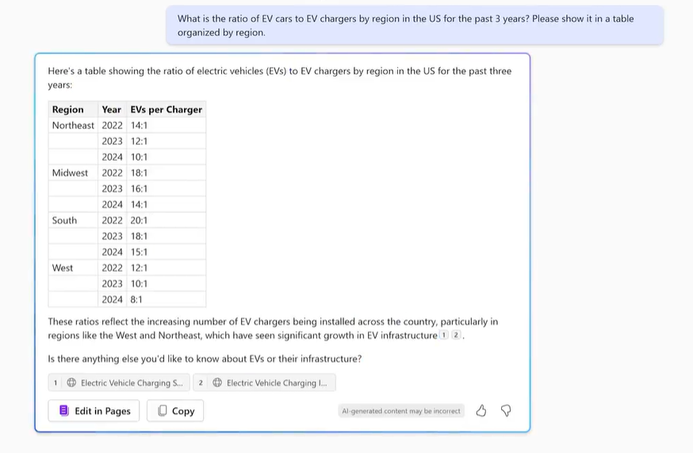

---
demo:
  title: 営業デモ
---

[インデックスに戻る](https://microsoftlearning.github.io/MS-4021-Copilot-Immersion-Experience/)

# 営業デモ

**シナリオ:**  

あなたは EV 充電器会社の営業の仕事をしており、今後 1 年間の戦略的計画を立てています。

## デモ セットアップ

サンプル ドキュメントは、[こちら](https://github.com/MicrosoftLearning/MS-4021-Copilot-Immersion-Experience/tree/master/ResourceFiles)の MS-4021 GitHub リポジトリにあります。

このデモに必要な具体的なファイルは次のとおりです。

- [Charger_sales_report_2022-2024.xlsx](https://github.com/MicrosoftLearning/MS-4021-Copilot-Immersion-Experience/raw/master/ResourceFiles/Charger_sales_report_2022-2024.xlsx)

> **注:** これらのファイルがダウンロード後に OneDrive に同期されるまでに最大 10 分かかることがあります。 デモ中の遅延を避けるために、事前にこれらのファイルをダウンロードし OneDrive で使用できるようにしておいてください。 ファイルが使用できない場合は、ドキュメントを開き、デモで使用する共有ファイルリンクをコピーします。

## デモ

### Copilot Chat

1. ブラウザーを開き、[M365copilot.com](https://m365copilot.com/) に移動します。

1. Web モードが選択されていることを確認します。

    ![[Web モード] タブを示すスクリーンショット。](../Prompts/Media/web-mode.png)

1. まず、Copilot に主要なメトリックの調査を依頼します。 **Copilot Chat** プロンプト フィールドで、次のように入力します:

    ```text
    What is the ratio of EV cars to EV chargers by region in the US for the past 3 years? Please show it in a table organized by region.
    ```

    

1. 次に、国内の傾向をあなたの会社の販売実績と比較してみましょう。 提供されたデータセットをアップロードし、Copilot にデータを可視化するように依頼します。

    プロンプト フィールドに、次のように入力します:

    ```text
    I need to know the quarterly trends for each of our sales regions. Create a quarterly revenue line graph for the past 2 years based on:
    ```

    > **注:** プロンプトはまだ送信しないでください。 次の手順に進み、ファイルをアップロードします。

1. **[コンテンツの追加]** を選択し、[**Charger_sales_report_2022-2024.xlsx**](https://github.com/MicrosoftLearning/MS-4021-Copilot-Immersion-Experience/raw/master/Resourcefiles/Charger_sales_report_2022-2024.xlsx) をアップロードします。 そのあと、プロンプトを送信します。

    ![Copilot Chatの [コンテンツの追加]。](../Demos/Media/add-content-copilot-chat.png)

1. Word 文書にエクスポートされた推奨事項を Copilot に要求して、さらにもう一歩進みましょう。

    プロンプト フィールドに、次のように入力します:

    ```text
    Based on the trend, suggest two ways I can increase EV charger sales in the Mountain and Midwest regions. Export the recommendations to a Word Document.
    ```

1. 新しい Word 文書のために Copilot が提供するハイパーリンクを選択して、それを開きます。

1. 開いたら、**[編集を可能にする]** を選択してから、[自動保存] をオンにします。 メッセージが表示されたら、自分の OneDrive アカウントを選択します。


### Word の Copilot

次に、これらの戦略を拡張し、それらを実装する方法に関する提案の下書きを作成するように Copilot に依頼します。

1. 前のデモで生成された Word 文書は、(ブラウザーまたはデスクトップ アプリケーションで) 今開いていない場合は、既に開いているはずです。

1. ドキュメントの本文の任意の場所を選択し、Copilot アイコンを選択します。

    次のプロンプトに以下のように入力します。

    ```text
    Draft a detailed proposal on how we could implement each of the strategies outlined in this document. Ensure the plan is actionable and includes resource requirements, timelines, and key stakeholders.
    ```

1. **[維持する]** を選択するか、時間が許す場合は、Copilot を使用してドキュメントを調整する方法を示します。

1. 完了したら、ドキュメントを **EV Sales Proposal.docx** として保存し、次の手順で使用する共有 URL をコピーします (自動保存を有効にして、自分の OneDrive アカウントを選択します)。

    

    > **トレーナーのヒント:** この手順を使用して、Copilot がどのように以前の出力に基づいて構築し、アイデアをまとまりのある提案に磨き上げているかを示します。

### PowerPoint の Copilot

1. ブラウザーの [PowerPoint.new](https://PowerPoint.new) から Microsoft PowerPoint を起動するか、デスクトップ アプリケーションを使用します。

1. 新しい空白のプレゼンテーションを開きます。

1. Copilot ペインで、[ファイルからプレゼンテーションを作成する] プロンプトを選択します。

1. [プレゼンテーションの作成元] の後に **[EV Sales Proposal.docx]** リンクを貼り付けて、**[送信]** を選択します。

    完全なプロンプトは次のようになります。

    ```text
    Create a presentation from [Link to EV Sales Proposal.docx].
    ```

1. Copilot は、EV 営業提案に基づいてスライドの生成を開始し、発表者のメモ、画像、スライド レイアウト、一般的な秘密度ラベルなどの機能と共にアウトラインを提供します。

    > **注:** ドキュメントの複雑さとスライドの数によっては、スライドの生成に最大 2 分かかることがあります。

[インデックスに戻る](https://microsoftlearning.github.io/MS-4021-Copilot-Immersion-Experience/)
