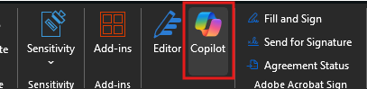

---
demo:
  title: 役員秘書のデモ
---

[インデックスに戻る](https://microsoftlearning.github.io/MS-4021-Copilot-Immersion-Experience/)

# 役員秘書のデモ

**シナリオ:**

あなたは、担当する役員向けに最新の収益に関する電話会議のトランスクリプトを要約する業務を任されました。 この業務には、重要な分析情報の抽出、エグゼクティブ サマリーの作成、フォローアップ会議の準備が含まれます。

## デモのセットアップ

サンプル ドキュメントは、[こちら](https://github.com/MicrosoftLearning/MS-4021-Copilot-Immersion-Experience/tree/master/ResourceFiles)の MS-4021 GitHub リポジトリにあります。

このデモに必要な具体的なファイルは次のとおりです。

- [Microsoft_FY24_Second_Quarter_Earnings_Conference_Call_Transcript.docx](https://github.com/MicrosoftLearning/MS-4021-Copilot-Immersion-Experience/raw/master/ResourceFiles/Microsoft_FY24_Second_Quarter_Earnings_Conference_Call_Transcript.docx)

> **注:** これらのファイルがダウンロード後に OneDrive に同期されるまでに最大 10 分かかることがあります。 デモ中の遅延を避けるために、事前にこれらのファイルをダウンロードし OneDrive で使用できるようにしておいてください。 ファイルが使用できない場合は、ドキュメントを開き、デモで使用する共有ファイルリンクをコピーします。

## デモの手順

### Word の Copilot

まず、最新の収益に関する電話会議のトランスクリプトを確認し、担当する役員にとって重要なポイントを要約します。

1. (ブラウザーまたはデスクトップ アプリケーションの) Word で **Microsoft_FY24_Second_Quarter_Earnings_Conference_Call_Transcript.docx** ファイルを選択して開きます。

    > **注:** ドキュメントをすばやくスクロールして、ドキュメントのサイズ感を把握し、要約するのが簡単な作業ではない場合は、それを認識しておいた方がよいでしょう。

1. リボンから Copilot アイコンを選択します。

    

1. [Copilot] ペインが開きます。 "**このドキュメントについて何でも質問してください**" と表示されている場所に、次のプロンプトを入力します。

    ```text
    Summarize the key points from the Microsoft FY24 Second Quarter Earnings Conference Call.
    ```

1. 担当する役員が、Satya Nadella が会議中に具体的に話し合った内容を知りたがっているとします。 次のプロンプトを使用します。

    ```text
    Provide a brief summary of Satya Nadella's remarks during the earnings call.
    ```

   - Copilot が各箇条書きの参照をどのように組み込んで、特定のセクションにすばやく移動できるようにするかを示します。  
   - 1 つの参照をクリックして、ドキュメント内の関連コンテンツにすばやくアクセスできることを実演します。

1. 詳細なレポートを作成するには、Copilot に次のように依頼します。

    ```text
    Analyze the Microsoft FY24 Second Quarter Earnings Conference Call document to provide a comprehensive report that includes:
    - A summary of the key points from each speaker
    - Identification of the top three growth areas and their contributing factors.
    - A detailed breakdown of the financial performance, including revenue, operating income, and earnings per share.
    - Trends in AI adoption and its influence on Microsoft's business strategy.
    - A comparison of this quarter's performance with the same quarter last year, highlighting significant changes.
    - Key strategic initiatives and future outlook as discussed in the call.
    ```

    > **ヒント:** これは複雑なプロンプトで、Copilot が応答を生成するのに少し時間がかかる場合があることに言及します。

1. Copilot が分析を完了したら、**Copy** アイコンを選択して、結果を次の手順のために保存します。

    


### Copilot Chat

Word から提供されるレポートは出発点として最適ですが、ここでは Copilot Chat を使用して、エグゼクティブ サマリーの作成に役立てたいと思います。

1. ブラウザーを開き、[M365copilot.com](https://m365copilot.com/) に移動します。

1. **[Web モード]** が選択されていることを確認します。

    ![[Web モード] タブを示すスクリーンショット。](../Prompts/Media/web-mode.png)

1. Copilot in Word からの応答を、次のプロンプトで Copilot チャットに貼り付けます。

    ```text
    Based on the following information, provide an executive summary on the following information:

    [paste the Word output here]
    ```

    > **注:** コピーしたコンテンツから無関係なテキストをクリーンアップして、わかりやすくします。

1. サマリーを改善して簡潔な形式にします。

    ```text
    Summarize this executive summary into a more concise format by focusing on the most critical insights and metrics for each speaker. Use a structured format with headings and bullet points to improve readability. Export to a Word document.
    ```

   - Copilot がドキュメントをエクスポートしない場合は、"このサマリーを Word 文書として保存してください" という依頼に言い換えます。

1. エグゼクティブ サマリーが完成したら、Copilot に次のように依頼します。

    ```text
    Based on the summarized executive summary, generate 5-7 concise and impactful talking points my manager can use in their next leadership call. Focus on key achievements, growth areas, and strategic priorities.
    ```

### Copilot in Outlook

このデモでは、Copilot in Outlook を使用して、第 2 四半期の収益に関する電話会議で持ち上がったすべての問題に迅速に対処する態勢を整えるために、役員との会議を設定します。

1. ブラウザーを開いて、[outlook.office.com](https://outlook.office.com.com/) に移動します。

1. Outlook のリボンで [Copilot] アイコンを選択し、[Copilot] ペインを開きます。

1. 次のプロンプトを使用して、同期をスケジュールします。

    ```text
    I need to schedule a 30-minute meeting with [/Pick a colleague] tomorrow afternoon to discuss the Second Quarter Earnings Conference Call. Can you suggest a time that works? If they are unavailable, provide an alternative.
    ```

1. Copilot が会議の日時を提案します。 プロンプトには、送信または編集できる予定表アイテムが表示されます。 **編集**を選択します。

1. スケジュール アシスタントに切り替えて、Copilot によって提案された時間がプロジェクト マネージャーに都合が良いことを示します。 両者とも空いている必要があります。

1. イベント タブに戻ってから、イベント本文で **[Draft with Copilot]** を選択します。

1. プロンプト ウィンドウで、次のように入力します。

    ```text
    I’m meeting with my boss to discuss key updates and strategic initiatives they missed from the Second Quarter Earnings Conference Call. Create an agenda to discuss financial performance, AI and technology integration, strategic acquisitions, productivity updates, and future outlook.
    ```

1. 必要に応じて、**[維持する]** を選択する前に、下書きのアジェンダを長くまたは短くしたり、そのトーンを変更したりするように Copilot に依頼できます。

[インデックスに戻る](https://microsoftlearning.github.io/MS-4021-Copilot-Immersion-Experience/)
