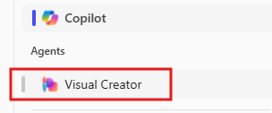

---
demo:
  title: マーケティングのデモ
---

[インデックスに戻る](https://microsoftlearning.github.io/MS-4021-Copilot-Immersion-Experience/)

# マーケティングのデモ

**シナリオ:**  

あなたは飲料会社のマーケティングを担当しており、市場の動向を分析し、マーケティング分析を作成し、新しいソーシャル メディア キャンペーンを開発することが目標です。

## デモ セットアップ

サンプル ドキュメントは、[こちら](https://github.com/MicrosoftLearning/MS-4021-Copilot-Immersion-Experience/tree/master/ResourceFiles)の MS-4021 GitHub リポジトリにあります。

このデモに必要な具体的なファイルは次のとおりです。

- [Promotion_Plan_for_Chai_Tea_in_Latin_America.docx](https://github.com/MicrosoftLearning/MS-4021-Copilot-Immersion-Experience/raw/master/ResourceFiles/Promotion_Plan_for_Chai_Tea_in_Latin_America.docx)

- [Mystic_Spice_Premium_Chai_Tea_product_description.docx](https://github.com/MicrosoftLearning/MS-4021-Copilot-Immersion-Experience/raw/master/ResourceFiles/Mystic_Spice_Premium_Chai_Tea_product_description.docx)

- [Contoso_Chai_Tea_market_trends.docx](https://github.com/MicrosoftLearning/MS-4021-Copilot-Immersion-Experience/raw/master/ResourceFiles/Contoso_Chai_Tea_market_trends.docx)

- [Contoso_Chai_Tea_social_marketing_trends.xlsx](https://github.com/MicrosoftLearning/MS-4021-Copilot-Immersion-Experience/raw/master/ResourceFiles/Contoso_Chai_Tea_social_marketing_trends.xlsx)

> **注:** これらのファイルがダウンロード後に OneDrive に同期されるまでに最大 10 分かかることがあります。 デモ中の遅延を避けるために、事前にこれらのファイルをダウンロードし OneDrive で使用できるようにしておいてください。 ファイルが使用できない場合は、ドキュメントを開き、デモで使用する共有ファイルリンクをコピーします。

## デモ

### Copilot in Word

Copilot in Word を使用して、詳細な市場分析レポートの下書きを作成し、ラテン アメリカ市場に合わせたクリエイティブ マーケティング キャンペーンのアイデアをブレーンストーミングします。

1. (Web ブラウザーまたはデスクトップ アプリケーションの) Word を開きます。

1. **[Copilot で何についての下書きをしますか?]** プロンプト ボックスに、次のように入力します。

    ```text
    Create a Market Analysis report for Mystic Spice Premium Chai Tea using the attached files. Include the product description, market trend analysis, and a promotion plan for Latin America.

    [Promotion_Plan_for_Chai_Tea_in_Latin_America.docx], [Mystic_Spice_Premium_Chai_Tea_product_description.docx], [Contoso_Chai_Tea_market_trends.docx]
    ```

    > **注:** 角かっこは、ドキュメントが参照されていることを示します。 ドキュメントを参照する場合は、共有リンクを直接貼り付けるか、OneDrive で使用できる場合はファイル名を参照できます。

1. ソーシャル メディア キャンペーンのアイデアを追加する新しいセクションを Copilot に作成させます。

    次のプロンプトを入力します。

    ```text
    Draft a new section for social media campaigns to promote Mystic Spice Premium Chai Tea. Include a brief description of 2-3 campaign ideas, each with a unique focus. For each campaign, provide a tagline that reflects its theme and resonates with our target audience of young professionals and tea enthusiasts.
    ```

1. [Copilot] ウィンドウで [保持する] を選択して、ドキュメントを Copilot の下書きから実際の Word 文書に変更します。 次に、この新しいドキュメントを **LATAM_Market_Analysis.docx** として保存します。

### Copilot Chat

Copilot Chat を使用して、提案されたソーシャル メディア キャンペーンの有効性を評価し、LATAM 市場における文化的関連性に合わせて戦略を調整します。

1. ブラウザーを開き、[M365copilot.com](https://m365copilot.com/) に移動します。

1. [Web モード] が選択されていることを確認します。

    ![[Web モード] タブを示すスクリーンショット。](../Prompts/Media/web-mode.png)

1. プロンプト ウィンドウで、次のように入力します。

    ```text
    Review the social media campaigns outlined in the Market Analysis Report for Mystic Spice Premium Chai Tea.docx. Evaluate which campaign might resonate best with the LATAM market based on cultural relevance, target audience preferences, and alignment with regional trends. Provide reasons for your choice and suggest any adjustments to improve its impact.
    ```

    > **注:** プロンプトはまだ送信しないでください。 次の手順に進み、ファイルをアップロードします。

1. **[コンテンツの追加]** を選択し、前のデモで OneDrive に保存した **LATAM_Market_Analysis.docx** をアップロードします。 そのあと、プロンプトを送信します。

    ![Copilot Chatの [コンテンツの追加]。](../Demos/Media/add-content-copilot-chat.png)

1. 重点を置くべきキャンペーンの 1 つを Copilot が推奨し、改善の提案をします。 次のプロンプトでは、この新しいアイデアに合うマーケティング キャンペーン スローガンを Copilot に提案してもらいます。

    ```text
    Generate a catchy marketing slogan for the [Campaign name - e.g., 'Morning Motivation'] campaign that highlights its unique value proposition and resonates with the LATAM market. Ensure the slogan reflects a vibrant and culturally relevant tone that appeals to young professionals.
    ```

1. 必要に応じて、最後のプロンプトで、キャンペーンの新しいビデオを生成するように Copilot に依頼できます。

    Copilot Chat の右側で、**Visual Creator エージェント**を選択します。

    

    次に、次のプロンプトを入力します。

    ```text
    Create a captivating social media video for Mystic Spice Chai Tea that highlights its unique flavor and vibrant appeal. The video should feature eye-catching visuals, with colors, and themes that resonate with young professionals and tea enthusiasts.
    ```

### Copilot in Excel

1. [Contoso_Chai_Tea_market_trends_2023.xlsx](https://github.com/MicrosoftLearning/MS-4021-Copilot-Immersion-Experience/raw/master/Contoso_Chai_Tea_market_trends_2023.xlsx) をダウンロードしてあることを確認し、このドキュメントを (Web またはデスクトップ アプリケーションの) Excel で開きます。

1. Excel リボンから **[Copilot]** を選択し、**[アプリ スキル]** を選択して [Copilot] ウィンドウを開きます。

1. 次のプロンプトを Excel に入力します。

    ```text
    On average, how many sales do we get per social media campaign view?
    ```

1. 次に、売上とソーシャル メディア エンゲージメントを比較するように Copilot に依頼します。

    ```text
    Can you show a correlation between social media engagement and sales?
    ```

1. 次に、以下のプロンプトを入力します。

    ```text
    How many social media campaign views did we have from September to December?
    ```

[インデックスに戻る](https://microsoftlearning.github.io/MS-4021-Copilot-Immersion-Experience/)
