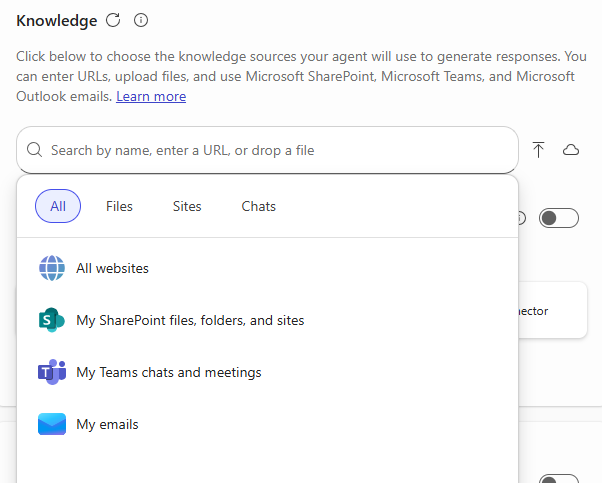

---
task:
  title: イマージョン エクスペリエンス – エージェント (ビジネス ユーザー)
---

## イマージョン エクスペリエンス – エージェント (ビジネス ユーザー)

Microsoft 365 Copilot と Copilot Studio を使って簡単な**検索ベースのエージェント**を設計すると、日常の生産性の課題の解決にどのように役立つかについて説明します。 この簡潔な演習では、一般的な問題を特定し、AI がどのように役立つかを調べてから、簡単なエージェントを作成してテストする手順を見ていきます。  

次の 3 つのタスクを実行します。

- 生産性の問題を特定する  
- AI が検索と整理にどのように役立つかを調べる  
- **Copilot Studio** で簡単なエージェントを構築してテストする  

> **注:** 作業を始めるのに役立つサンプル プロンプトが提供されており、状況に合わせて自由にカスタマイズできます。  
>
> プロンプトの生成や改善について手助けが欲しい場合は、<a href="https://appsource.microsoft.com/en-us/product/office/WA200007578" target="_blank">Prompt Coach エージェント</a>を試してみてください。それを使ってプロンプトを提案、改善、評価し、Copilot でより良い結果を得ることができます。

### タスク 1:生産性の課題を特定する  

日々の作業でよくある問題について考えてみましょう。情報の検索や整理が遅くなったり、難しくなったりするような場合です。 独力で対応することも、パートナーとして **Copilot Chat** を使ってアイデアの生成や一般的な問題の特定に役立てることもできます。

例 :

- ドキュメントの最新バージョンの検索  
- 複数のメールまたはチャットからの更新の収集  
- 過去のプロジェクトや会議の詳細の想起  

**手順**:  

- 新しいブラウザー タブを開き、[m365.cloud.microsoft/chat](https://m365.cloud.microsoft/chat) に移動します。 

- **Copilot Chat** で **[作業モード]** タブが選ばれていることを確認します。  

   ![Copilot Chat の [作業モード] タブを示すスクリーンショット。](../Prompts/Media/work-mode.png)  

    **サンプル プロンプト:**

    ```text
    Summarize the top challenges I face in my daily work, based on recent emails, chats, and documents. Show results in a simple list with: 
    
    - Title (short label for the issue) 
    - Description (1–2 sentences) 
    ```  

### タスク 2:リサーチ ツールを使って AI ソリューションのアイデアを調べる  

**リサーチ ツール エージェント**を使って、選んだ課題に Copilot やエージェントがどのように役立つ可能性があるかを調べます。

**手順**:  

- Copilot Chat メニューで、**[エージェント]** を展開して **[リサーチ ツール]** を選びます。  

   ![M365 Copilot メニューで選ばれた [リサーチ ツール] を示すスクリーンショット。](../Prompts/Media/researcher.png)  

- 次のようなサンプル プロンプトを試します。  

   ```text
   Explore possible AI solutions to help with [insert productivity issue]. Focus on retrieval-based approaches using Focus on retrieval-based approaches using Microsoft Copilot or Copilot Studio agents. Summarize two or three ways an agent could help me find, organize, or summarize information more efficiently.
   ```  

    > **ヒント:** ドキュメントのすばやい表示や、複数のソースからの更新の取得など、実用的で日常的なユース ケースから焦点を逸らさないようにします。  

### タスク 3:エージェントを構築してテストする  

次に、課題に対処するための簡単な検索エージェントを **Copilot Studio** で作成します。  

**手順**:  

1. **Copilot Chat** のメニューで、**[エージェントの作成]** を選びます。

   ![[エージェントの作成] リンクを示すスクリーンショット。](../Prompts/Media/create-agent.png)  

1. **[説明]** タブで、エージェントの役割を下書きします。 次に例を示します。  

   ```text
   You’re a virtual assistant that helps me with [key task]. Be concise and always reference my recent files or resources when possible.
   ```  

     

1. **[構成]** タブを選び、1 つのナレッジ ソース (たとえば、**[自分のメール]** または **[自分の Teams チャットと会議]**) を追加します。

    

1. **[テスト]** ペインを使ってエージェントをテストし、必要に応じて調整します。  
1. **[作成]** を選んでエージェントを発行し、使い始めます。  

> **ヒント:** 最近のプロジェクト ファイルを見つけるような非常に簡単なエージェントでも、日々の作業での検索の威力を示すことができます。
