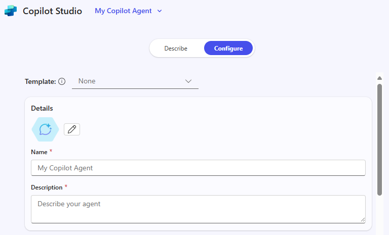

---
task:
  title: イマージョン エクスペリエンス – エージェント (エグゼクティブ)
---

## イマージョン エクスペリエンス – エージェント (エグゼクティブ)

Microsoft 365 Copilot と Copilot Studio を使って、単純な**検索ベースのエージェント**を設計することで、実際の作業に関連する課題にどのように対処できるかを調べます。 この演習では、問題を特定し、それを分析して、AI が役立つ可能性のある場所を探してから、それを解決するための概念的エージェントを作成する方法を見ていきます。  

次の 4 つのタスクを実行します。

- 作業に関連する問題を特定する  
- 問題を分解して AI が役に立つ可能性のある場所を調べる  
- **リサーチ ツール**を使ってインサイトとソリューションのアイデアを明らかにする  
- **Copilot Studio** で検索ベースのエージェントを概念化してモックアップする  

> **注:** 作業を始めるのに役立つサンプル プロンプトが提供されており、状況に合わせて自由にカスタマイズできます。 
>
> プロンプトの生成または改善に手助けが欲しい場合は、<a href="https://appsource.microsoft.com/en-us/product/office/WA200007578" target="_blank">Prompt Coach エージェント</a>を試してください<br>Copilot でより良い結果を得られるように、プロンプトの提案、改善、評価を行うことができます。

### タスク 1:作業に関連する課題を特定する  

まず、自分の役割で実際に発生している問題 (作業が遅い、情報にアクセスしにくい、など) について考えます。 独力で対応することも、パートナーとして **Copilot Chat** を使って知識を取得したり整理したりして、より適切なアイデアの生成や課題の特定に役立てたりすることもできます。  

考えるときは次のようなことを検討します。  

- **現在うまくいっていることは何か**  
- **うまくいっていないことは何か**  
- **AI はどのような点で役に立つ "可能性がある" か****  

**手順**:  

- 新しいブラウザー タブを開き、[m365.cloud.microsoft/chat](https://m365.cloud.microsoft/chat) に移動します。  
- **Copilot Chat** で **[作業モード]** タブが選ばれていることを確認します。  

   ![Copilot Chat の [作業モード] タブを示すスクリーンショット。](../Prompts/Media/work-mode.png)  

    **サンプル プロンプト:**

   ```text
   I’m researching common day-to-day issues I face at work, such as processes, collaboration, or time management. Look at recent conversations from [Teams chats, Outlook emails, or other collaboration tools] related to [your role focus]. Summarize the key issues or pain points mentioned in the last 6 months. Show the results in a table with:  

    - Title: Short label for the issue  
    - Description: Brief summary of the challenge  
    - Frequency: How often it comes up (e.g., number of mentions)
   ```

### タスク 2:問題を分解する

**Copilot Chat** を使って、タスク 1 で特定した課題を小さな部分に分解します。

- この問題を難しくしているのは何ですか?  
- 情報が詰まったり失われたりしているのはどこですか?  
- 最も影響を受けているのは誰ですか?  

    **サンプル プロンプト (Copilot チャット – 作業モード):**

    ```text
    Break down the problem of [insert challenge]. Identify root causes, pain points, and which areas of work are most affected.
    ```

    > **ヒント:** 知識を検索すると、時間が節約されたり、チームのより迅速な意思決定に役立ったりする場所について考えます。

### タスク 3:リサーチ ツールを使って AI ソリューションのアイデアを調べる

**リサーチ ツール エージェント**を使って、Copilot やエージェントがどのように役立つかを確認します。 タスクの自動化ではなく、知識を検索、整理、または要約するソリューションに焦点を当てます。 

**手順**:

- 新しいブラウザー タブを開き、[m365.cloud.microsoft/chat](https://m365.cloud.microsoft/chat) に移動します。
- Copilot Chat メニューで、**[エージェント]** を展開して **[リサーチ ツール]** を選びます  

    ![M365 Copilot メニューで選ばれた [リサーチ ツール] を示すスクリーンショット。](../Prompts/Media/researcher.png)  

    **サンプル プロンプト (リサーチ ツール エージェント):**

    ```text
    Explore possible AI solutions to address [insert problem]. Focus on retrieval-based approaches using Microsoft Copilot, Copilot Studio agents, or connected knowledge sources. Summarize three possible solution approaches, their benefits, and limitations.
    ```

    > **ヒント:** エージェントによって知識の検索、再利用、共有が容易になる機会を探します。

    > **注:** 研究者は、お客様の要求に応じて、完了するまでに 5 ~ 10 分かかる場合があります。 その応答は非常に詳細であるため、動作している間は、Copilot Chat で同じプロンプトを実行してみてください。 2 つの出力を比較するのは、各ツールがタスクにどのように近づくのかを確認する最適な方法です。

### タスク 4:エージェントを概念化する

次に、**Copilot Studio** でインサイトを得て簡単なモック エージェントを作成します。 検索に重点を置きます。エージェントは、情報の表示、整理、要約に役立つ必要があります。

**手順**:

- **Copilot Studio で始める**

    1. ブラウザーを開いて [m365.cloud.microsoft/chat](https://m365.cloud.microsoft/chat) に移動します。
    1. 右側のレールで **[エージェントの作成]** を選んで **Copilot Studio** を起動します。

        ![[エージェントの作成] リンクを示すスクリーンショット。](../Prompts/Media/create-agent.png)

- **エージェントを定義する ([説明] タブまたは [構成] タブ)**

    1. **[説明]** タブを選んで、次のサンプル プロンプトを使います (または独自のものを記述します)。

        ```text
        You’re a virtual assistant for our [project/team name]. Your role is to help with [key tasks]. Be concise, stay on-brand, and reference our shared resources when possible.
        ```

        

        > **注:** 一から始めることも、テンプレートであらかじめ指定されている設定と指示を基にし、それをカスタマイズしてエージェントを作成することもできます。

    1. **[説明]** を使用できない場合は、**[構成]** タブに切り替えて、名前、説明、エージェントの指示などの同じ詳細を手入力します。

        

- **エージェントをカスタマイズする**

    **[構成]** タブで、次のオプションを調べます。

    1. ナレッジ ソースを少なくとも 1 つ追加します (OneDrive や SharePoint またはメールに保存されたドキュメントなど)。

        

    1. 他のユーザーがエージェントを使い始めるのに役立つスターター プロンプトを定義する

        

        > **ヒント:** スターター プロンプトは、エージェントとの対話方法についてユーザーをガイドするのに役立ちます。

- **テストして作成する**

    1. **[テスト]** 機能 (エージェント構築プロセス全体を通して、右側のペインで使用可能) を使って、下書きしたエージェントを試し、問題を修正します。
    2. 問題がなければ、**[作成]** を選んでエージェントを発行します。
    3. エージェントを他のユーザーと共有するか、開いてすぐに使います。  

> **ヒント:** 今日の目標は、完全なエージェントを構築することではなく、検索重視のエージェントによって日々の作業での知識へのアクセスをどのように簡単にできるかを調べることです。
