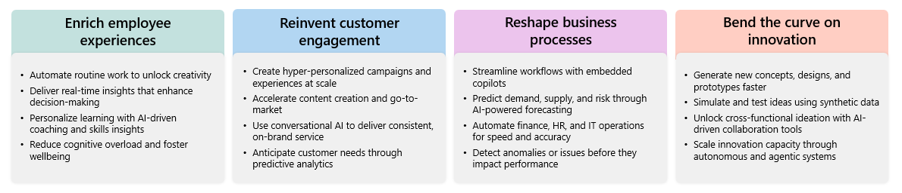
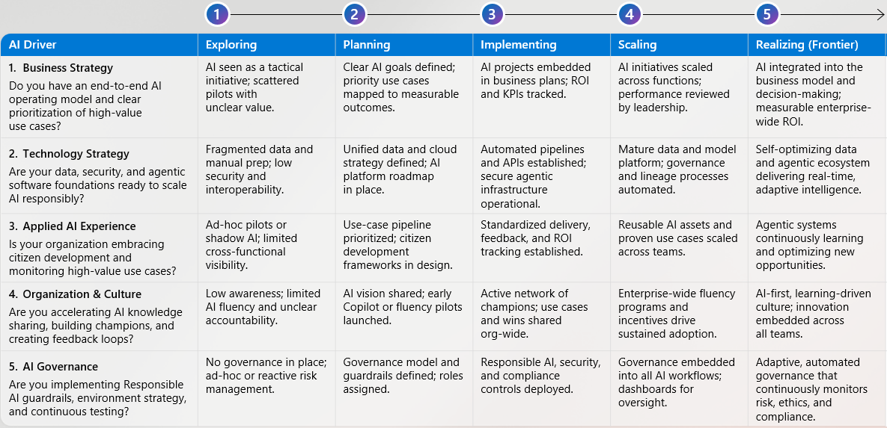

---
task:
  title: イマージョン エクスペリエンス - AI に対する抱負と機会
---

## AI に対する抱負と機会

AI に対する 12 か月の抱負を定義し、組織の準備状況を評価し、AI の価値を加速させるインパクトのある機会を特定する方法について探ります。

この演習では、**Copilot を戦略的思考パートナーとして**使用して優先順位を明確にし、ギャップを特定し、具体的な次のアクションを定義します。

次の 3 つのタスクを実行します。

- AI に対する抱負を定義する
- 主要な促進要因全体での AI の準備状況を評価する
- AI のギャップとアクションの機会を特定する

> **注:** 作業を始めるのに役立つサンプル プロンプトが提供されており、役割、組織、優先順位に合わせて自由にカスタマイズできます。

## タスク 1:AI に対する抱負を定義する (12 か月)

まずは、AI を使って今後 1 年間に影響を与えるビジネス成果を特定します。 ツールではなく**成果**に注目してください。

### 1. ビジネスの優先順位を特定する

自分の役割に特に欠かせない優先順位 (効率性、成長、イノベーション、リスク削減など) を振り返ります。 **Copilot Chat** を使用して、優先順位をブレーンストーミングして調整します。

- 新しいブラウザー タブを開き、[m365.cloud.microsoft/chat](https://m365.cloud.microsoft/chat) に移動します。

- **Copilot Chat** で **[作業モード]** タブが選ばれていることを確認します。  

   ![Copilot Chat の [作業モード] タブを示すスクリーンショット。](../Prompts/Media/work-mode.png)  

    **サンプル プロンプト:**
  
    ``` text
    From my role as [insert role], what are the top 1–2 business priorities that AI could materially impact over the next 12 months? Focus on outcomes, not technology.
    ```

    > Word、OneNote、または Copilot ページの**応答をキャプチャ**します。 このメモはタスク 3 で使用します。

### 2. 成功がどのようなものかを定義する

AI に対する抱負が実現した場合に成功の兆候を示す、目に見える結果について説明してください。

**サンプル プロンプト:**

``` text
If we successfully achieved this AI aspiration, what measurable outcomes or changes would indicate success? Provide examples of metrics or observable improvements.
```

> タスク 3 で使用するために**応答をキャプチャ**します。

### 3. AI の価値領域を選択する

4 つの AI の価値領域をレビューし、どれが優先順位の変更に最も影響するかを特定します。

   

## タスク 2:AI の準備状況を評価する

抱負を定義したので、組織の現在位置を評価します。

### AI の準備状況の促進要因

次の 5 つの促進要因の成熟度を評価します。

1. ビジネス戦略
1. テクノロジ戦略
1. 適用済みの AI エクスペリエンス
1. 組織と文化
1. AI ガバナンス

  

Copilot を使用して、これらの促進要因全体で組織が現在どこにいるかを考えます。

**サンプル プロンプト:**

``` text
Act as a strategic advisor. Based on the AI readiness model, help me assess my organization’s current maturity across business strategy, technology strategy, applied AI experience, organization & culture, and AI governance. Summarize where we are today (Exploring, Planning, Implementing, Scaling, or Realizing).
```

> タスク 3 で使用するために**応答をキャプチャ**します。

## タスク 3:ギャップと機会を特定する

次に、抱負を現在の状態と比較して、最も重要なギャップと機会を特定します。

### 手順 1:Copilot にギャップの要約を依頼する

``` text
Here is my AI aspiration and AI readiness self-assessment:
[paste notes]

Summarize in 3–5 sentences the key gap between my aspiration and current state. 

Then write an 'opportunity to accelerate AI impact' statement showing how closing this gap could unlock measurable value.
```

### 手順 2:アクションの機会を絞り込む

ギャップを埋めるために**自分がリードしたり、変更のスポンサーになったりできる**領域を特定します。

**サンプル プロンプト:**

``` text
What is the single highest-impact action I could lead in the next 90 days to close this AI gap and accelerate measurable business value?
```
