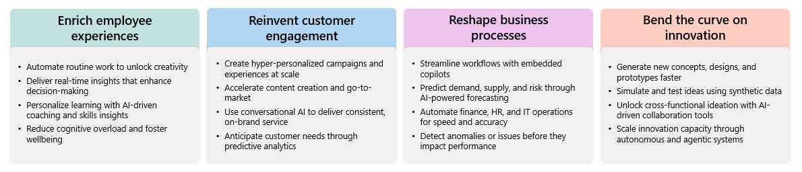

---
task:
  title: イマージョン エクスペリエンス - AI の優先順位を定義する
---

## AI の優先順位を定義する

明確な **12 か月間の AI に対する抱負**を定義し、価値を加速させるための**最も影響力の大きいイニシアティブ**を特定します。

この演習では、Copilot は**戦略的思考パートナー**として機能し、成果の明確化、機会の特定、取り組みの集中に役立ちます。

以下の 3 つの手順を完了します。

- AI に対する抱負を定義する (12 か月)
- 主要な AI イニシアティブを特定する
- 優先的に取り組むべきイニシアティブを 1 つ選択する

> **注:** 作業を始めるのに役立つサンプル プロンプトが提供されており、役割、組織、優先順位に合わせて自由にカスタマイズできます。

## 手順 1: AI に対する抱負を定義する (12 か月)

まず、今後 1 年間で AI で推進できる、**影響力の大きいビジネス成果**を特定することから始めましょう。

組織の運営方法や価値の提供方法に意義のある変化をもたらすような成果に焦点を当ててください。

### 1. 優先すべき成果を特定する

- 新しいブラウザー タブを開き、[m365.cloud.microsoft/chat](https://m365.cloud.microsoft/chat) に移動します。

- **Copilot Chat** で **[作業モード]** タブが選ばれていることを確認します。  

   ![Copilot Chat の [作業モード] タブを示すスクリーンショット。](../Prompts/Media/work-mode.png)  

    **サンプル プロンプト:**
  
    ``` text
    For my organization, what are the top 1–2 business priorities that AI could materially impact over the next 12 months? Focus on measurable outcomes, not specific technologies.
    ```

    > **ヒント**:これをご自分の個々のコンテキストに合わせて調整するには、**"自分の組織の場合、"** を、**"自分のロールの場合 [ロール名を挿入]"** に置き換えます
    > 
    > Word、OneNote、または Copilot ページの**応答をキャプチャ**します。 これらのメモは、次の手順で使用します。

### 2. 成功がどのようなものかを定義する

AI の抱負が実現した場合の成功を示す測定可能な成果指標 (KPI) について記述します。

**サンプル プロンプト:**

``` text
If we successfully achieved this AI aspiration, what measurable outcomes or changes would indicate success? Provide examples of metrics or observable improvements.
```

> タスク 3 で使用するために**応答を取り込みます**。

### 3. AI の価値領域を選択する

AI の 4 つの価値領域を検討し、抱負の達成に最も直接的に役立つ領域を特定します。

   

## 手順 2: AI イニシアティブを特定する

次に、この抱負をより小さく、実行可能なイニシアティブに分解します。

### 1. イニシアティブのアイデアを生成する

**サンプル プロンプト:**

``` text
Based on this AI aspiration:

[paste your aspiration]

Suggest 2–3 practical AI initiatives that could help achieve this outcome.
```

### 2. イニシアティブを取り込む

次の内容を記録します。

- **この抱負に貢献している既存のイニシアティブの 1 つ**
- **達成に向けた進歩を加速させる可能性のある新しい機会**

> 簡潔に記載します。それぞれについて、名称と 1 文の説明だけで構いません。

## 手順 3: 重点に優先順位を付ける

今後 90 日以内に測定可能な価値をもたらす可能性が最も高いイニシアティブを選択します。

### ギャップと重点を特定する

``` text
Given my AI aspiration and these initiatives:

[paste your aspiration and initiatives]

What is the biggest gap or risk that could prevent success?

Which initiative would create the most measurable value in the next 90 days, and why?
```

### 最終出力

この演習を終了すると、次のものが得られます。

- 1 つの明確な **AI に対する抱負 (12 か月後の成果)**
- 2 つのイニシアティブ (**既存 + 新規**)
- **優先的に取り組むべき 1 つのイニシアティブ**

> この優先的なイニシアティブを起点として、90 日間の集中的な計画を通じて、より広範な AI に対する抱負の実現に着手します。

