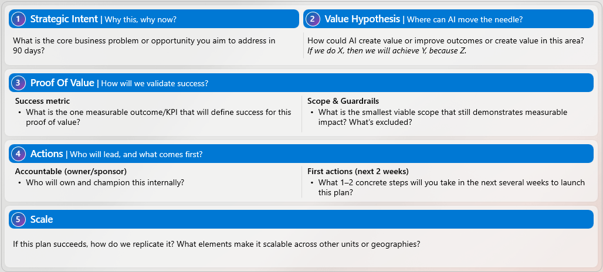
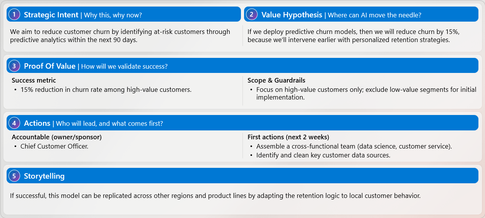

# 次の AI "Lighthouse" を設計する

目に見えるビジネス価値をもたらし、AI がどのようにして大規模にインパクトを与えるかを示す、集中型の **90 日間 AI イニシアティブ**を定義します。

この演習では、価値をすばやく証明し、組織全体にレプリケートできる、小規模でありながらインパクトのあるプロジェクト、**AI Lighthouse** を設計します。

**Word、OneNote、Copilot ページ、または選択した別のツール**で、作業内容をキャプチャします。 Copilot は、**レビューと洗練化のパートナー**として機能するもので、あなたに代わって判断するものではありません。

## タスク 1:自分の AI Lighthouse を設計する

まず、以下の **AI Lighthouse Canvas** を使用して、Lighthouse のアウトラインを作成します。  

これを**思考のフレームワーク**として使用します — このページにない回答を Word、OneNote、Copilot Pages、または選択した別のツールで文書化します。

ツールや実装の詳細ではなく、**結果、影響、測定可能性**に焦点を当てます。



### 1. 戦略的な意図 — *なぜこれを、今行うのですか?*

**以下の点を考慮してください。**

- 今後 90 日以内に対処しようとしている主要なビジネス上の問題や機会は何ですか?
- なぜ今が、行動する絶好のチャンスなのですか?

### 2. 価値仮説 — * AI はどこに影響を与えることができますか?*

原因と結果の簡単な文章を使用して、AI がどのように価値を生み出すかについて説明します。

**形式**:

> *X を行うと、Z なので Y が実現します。*

### 3. 価値の証明 — *成功をどのようにして検証しますか?*

**成功のメトリック: **

- この Lighthouse の成功を定義する、**目に見える 1 つの結果または KPI** は何ですか?

**スコープとガードレール: **

- 依然として価値を示す**最も小さく、実行可能なスコープ**は何ですか?
- 明示的に**スコープ外**であるものは何ですか?

### 4. アクション — *誰がリードし、何が最初に来ますか?*

**説明責任を負う所有者: **

- この Lighthouse を内部で所有し、推進するのは誰ですか?

**最初のアクション (次の 2 週間): **

- これを開始するための **1 ～ 2 つの具体的なステップ**は何ですか?

### 5. ストーリーテリング — *どのようにスケーリングしますか?*

この Lighthouse が成功した場合: 

- チーム、リージョン、ビジネス ユニット間でどのようにレプリケートできますか?
- どんな要素があれば再利用可能または反復可能になりますか?

## オプションの参照: サンプルの AI Lighthouse

以下のサンプルの Lighthouse をレビューし、完成した 90 日間 Lighthouse の外観を確認すると、役に立つかもしれません。

これは、**構造と詳細レベルのみの参照**として使用してください - ご自分の Lighthouse には、独自の優先順位、制約、ビジネス コンテキストが反映されている必要があります。



## タスク 2:Copilot でドラフトをレビューする

Lighthouse のドラフトが完成したら、Copilot を使用してそのレビューと強化を行います。

**サンプル プロンプト:**

```text
Here is my draft of the 90-day Lighthouse Canvas for an AI initiative.

Please review it and suggest how I can make it more clear, compelling, and measurable for executive stakeholders. Focus your feedback on clarity, focus, and business impact.

Based on what you see, what would you recommend I improve or clarify, given what you know about my organization and priorities?
```

> **注:**  
> ドラフトを Copilot と共有するには、完成した Lighthouse Canvas のスクリーンショットを撮り、Copilot に貼り付けます。
> - **Windows:****Windows + Shift + S** を押して Canvas をキャプチャします
> - **Mac: ****Command + Shift + 4** を押して Canvas をキャプチャします  
> スクリーンショットをアップロードする代わりに、ドラフトのテキストを Copilot に直接貼り付けることもできます。

## タスク 3:1 分間のエグゼクティブ ピッチを作成する

Copilot を使用すると、Lighthouse を **簡潔な 1 分間のピッチ**に変えるのに役立ちます。

**サンプル プロンプト:**

```text
Based on my updated 90-day Lighthouse Canvas, help me create a concise 1-minute pitch for my key stakeholder:
[describe your stakeholder, e.g., "Chief Operating Officer responsible for digital transformation"].

The pitch should clearly explain the business problem, the proposed AI solution, the expected impact, how success will be measured, and why this matters to my stakeholder.

Please make the language clear, compelling, and suitable for an executive audience.

Here is my draft:
[paste your revised Lighthouse Canvas or summary here]
```
