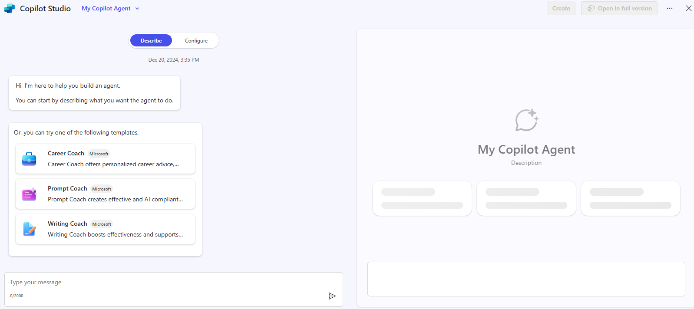
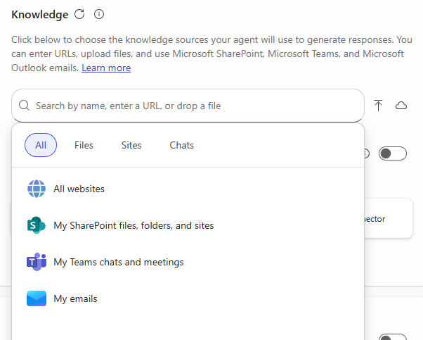

---
task:
  title: 没入体験 – アイデアからエージェントへ
---

## 没入体験 – アイデアからエージェントへ

Microsoft 365 Copilot が、インスピレーションから動作するエージェントまで、アプリ間で 1 つのアイデアを展開する方法を体験します。 会社や製品の概念をブレーンストーミングし、それをドキュメントに整形し、ピッチ デッキに変換し、独自の業務に基づくカスタム エージェントを構築して終了します。

次の 4 つのタスクを実行します。

- **Copilot Chat** でアイデアをブレーンストーミングし、リサーチする
- **Copilot in Word** で概念ドキュメントの下書きを作成する
- **Copilot in PowerPoint** でピッチ デッキを生成する
- **Copilot Studio** でカスタム エージェントを構築する

各タスクで次のタスクを基にした成果物が作成されるので、手順を進めながら **OneDrive** にファイルを保存します。

> **注:** 作業を始めるのに役立つサンプル プロンプトが提供されており、アイデアに合わせて自由にカスタマイズできます。
> 最初に、Copilot からうまく出力されない場合は、プロンプトを絞り込んでもう一度試してみてください。

### タスク 1: アイデアのブレーンストーミングとリサーチ (Copilot Chat)

Copilot Chat を使用して、実際の市場のすき間を埋める会社や製品のアイデアを生み出し、競争環境をリサーチします。

**手順**:

- ブラウザーを開いて [m365.cloud.microsoft/chat](https://m365.cloud.microsoft/chat) に移動します。
- Microsoft の職場アカウントでサインインし、次のプロンプトを入力します。

    **サンプル プロンプト (ブレーンストーミング):**

    ```text
    Help me identify gaps in the [specific market or industry] that could be opportunities
    for a new product or company. Look for underserved areas or emerging trends to capitalize on.
    ```

    **サンプル プロンプト (競合企業のリサーチ):**

    ```text
    I'd like to explore the [industry or market segment] sector. Who are the key competitors?
    ```

- 両方の回答を新しい Word 文書にコピーし、OneDrive に **Copilot Research.docx** として保存します。

> **重要:** OneDrive (ローカル PC ではなく) に保存します。次のタスクでは、Copilot がこのファイルにアクセスする必要があります。

### タスク 2: 概念ドキュメントの下書きを作成する (Copilot in Word)

リサーチを包括的なコンセプト (ミッション、ビジョン、価値観、提供内容、対象者、市場優位性) に変換します。

**手順**:

- **Copilot Research.docx** を開き、**[共有] → [リンクのコピー]** の順に選択します。

    ![[共有] メニューと [リンクのコピー] オプションが強調表示されているスクリーンショット。](../Exec/Media/share-menu-with-copy-link.png)

- [Word.new](https://Word.new) で Word を起動し、空白のドキュメントを開いて **[Copilot で下書き]** を選択します。

    ![[Copilot in Word で下書き] アイコンが示されているスクリーンショット。](../Prompts/Media/draft-with-copilot.png)

    **サンプル プロンプト:**

    ```text
    Draft a concept for our new [company or product] referencing [link to Copilot Research.docx],
    including its mission, vision, core values, offerings, target audience, and unique market edge.
    ```

- **[生成]** を選択し、下書きを確認してから、**Product Concept.docx** として OneDrive に保存します。

> **ヒント:** 保存する前に絞り込みます。たとえば "潜在的なスポンサーに対してこれをより説得力のあるものにしてください" または "要約を改善して簡潔でインパクトのあるものにしてください" と依頼します。****

### タスク 3: ピッチ デッキを生成する (Copilot in PowerPoint)

概念を、価値、市場の可能性、競争優位性を強調する取締役会向けのピッチデッキに変身させましょう。

**手順**:

- **Product Concept.docx** を開き、**[共有] → [リンクのコピー]** の順に選択します。
- [PowerPoint.new](https://PowerPoint.new) で PowerPoint を起動し空白のプレゼンテーションを開きます。
- Copilot ペインで **[ファイルからプレゼンテーションを作成]** を選択し、リンクを貼り付けます。

    **サンプル プロンプト:**

    ```text
    Create a presentation from [Link to Product Concept.docx].
    ```

- 生成されたスライドを確認し、必要に応じて調整します。

> **ヒント:** たとえば "この製品が直面する可能性のある課題を 2 枚のスライドで追加し、それを軽減するための戦略を 1 枚のスライドにまとめてください" のようなプロンプトを使い拡充させてみましょう。**

### タスク 4: カスタム エージェントを構築する (Copilot Studio)

作成したファイルを基にしたエージェントを作成して、一連の作業を完結させます。

**手順**:

- **Copilot Studio で始める**

    1. [m365.cloud.microsoft/chat](https://m365.cloud.microsoft/chat) にアクセスしてサインインします。
    1. 右側のレールで **[エージェントの作成]** を選択し **Copilot Studio** を起動します。

        ![[エージェントの作成] リンクを示すスクリーンショット。](../Prompts/Media/create-agent.png)

- **エージェントを定義する ([説明] タブ)**

    ```text
    You're a virtual assistant for our [project/team name]. Your role is to help with
    [key tasks]. Be concise, stay on-brand, and reference our shared resources when possible.
    ```

    

- **エージェントをカスタマイズする ([構成] タブ)**

    1. ナレッジ ソースを追加します。OneDrive または SharePoint で **Copilot Research.docx** や **Product Concept.docx** を使用します。

        

    1. 他の人があなたのエージェントを使う場合にガイドとなる最初のプロンプトを定義します。

        

- **テストして作成する**

    1. **[テスト]** ペインを使って下書きエージェントをテストし、問題点を修正します。
    1. **[作成]** を選択して発行し、すぐに使用できるように共有します。

> **重要:** エージェントが特定のコンテンツからプルするようにしたい場合は、発行前にナレッジ ソースを追加して構成します。

## このワークショップの成果

このセッションの終わりまでに、Copilot を使用して 1 つのアイデアを最初から最後まで完了させることができるようになります。

- リサーチされた市場機会
- 概念のドキュメント
- 取締役会向けのピッチ デッキ
- 実働し、知識に根ざしたエージェント
