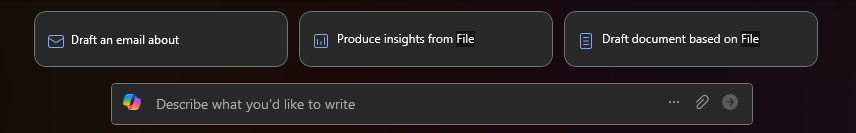

---
task:
  title: イマージョン エクスペリエンス - 財務
---

## イマージョン エクスペリエンス - 財務  

Microsoft 365 Copilot を使用して主要な財務分析情報を収集、分析、文書化することで、財務上の意思決定を改善します。

次の 3 つのタスクを実行します。  

- **Copilot Chat** を使用して財務データを収集する。  
- **Copilot Chat** を使用して財務上の影響と傾向を評価する。  
- **Copilot in Word** を使用して財務分析ドキュメントの下書きを作成する。  

> **注:** 作業を開始するのに役立つサンプル プロンプトが用意されています。 これらを自分のニーズに合わせて自由にカスタマイズします - 創造的な姿勢で取り組み、応用方法を探ってください。 求める結果が Copilot で得られない場合は、プロンプトを改善して、もう一度やり直してください。 このプロセスと実験を楽しんでください。  

### タスク 1: 財務データを収集する  

**Microsoft 365 Copilot Chat** を使用して、選択した企業または業界の市場動向向、売上分析情報、コスト構造など、関連する財務データを収集します。 この情報は、財務分析の強固な基盤を確立するのに役立つので、業績を評価するための正確なデータ ポイントを確保できるようになります。

**手順**:

- 新しいブラウザー タブを開き、[M365copilot.com](https://m365copilot.com/) に移動します。
- **Copilot Chat** で **[Web モード]** タブが選択されていることを確認します。

    

**サンプル プロンプト**:

```text
Summarize key financial indicators for [company/industry] over the last year, including revenue growth, cost trends, and market conditions.
```

> **注:** [company/industry] を、分析対象とする特定の会社や業界に置き換えます。 **/** 文字 (スラッシュ) を使用すると、必要に応じて社内データを参照できます。

### タスク 2: 財務上の影響と傾向を評価する  

**Microsoft 365 Copilot Chat** を使用して、収集した財務データを評価して傾向、リスク、商機を特定します。 コスト変動、売上増加パターン、その他の重要な指標を分析して、意思決定に役立つ意味のある分析情報を抽出します。

**サンプル プロンプト**:

```text
Based on recent financial performance, identify key trends, risks, and opportunities for [company/industry]. Provide insights on cost fluctuations and revenue projections.
```

> **ヒント 1:** より詳細な分析が必要な場合は、複数の期間または企業の傾向を比較するように Copilot に依頼してください。

> **ヒント 2**  
>
> - 応答を Word 文書にエクスポートして次のタスクのために保存するように Copilot に依頼します。 ドキュメントを OneDrive に保存し、共有 URL をコピーします。
> - リンクをコピーするには、保存した Word 文書を開き、次に示すように **[共有]**、**[リンクのコピー]** の順に選択します。  
> 

### タスク 3: 財務分析ドキュメントを下書きする  

Word で **Copilot を使用**して、主要な調査結果、傾向、戦略上の推奨事項を要約した構造化された財務分析ドキュメントを作成します。 ドキュメントが重要なポイントを明確に提示していることを確認して、財務上の見通しや影響を関係者がすばやく理解できるようにします。

**手順**:

- ブラウザーから Microsoft Word を起動 (アドレス バーに「[word.new](https://word.new)」と入力) するか、デスクトップ アプリケーションを使用します。
- "**書きたい内容を記述してください**" と表示された場所にプロンプトを入力します。

    

**サンプル プロンプト**:

```text
Draft a financial analysis report on [company/industry], summarizing key revenue trends, cost analysis, profitability insights, and future financial projections. Use the insights from the linked document to structure the report logically.

[Paste link to shared Word document from Task 2 here]
```

> **ヒント:** **[保持]** を選択する前に、トピックを発展させたり明確になるようにトーンを調整したりしてドキュメントを改善するように、Copilot に依頼してください。
